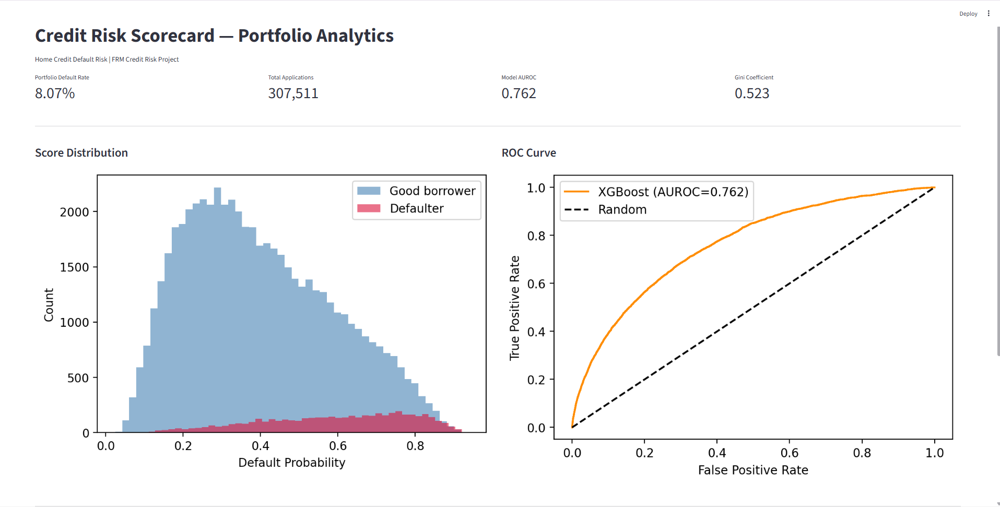
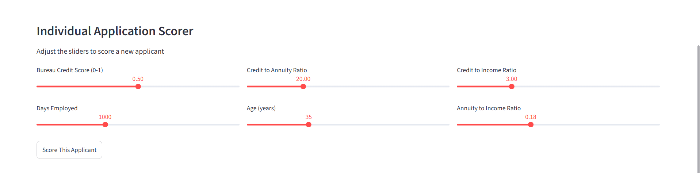

# Credit Risk Scorecard — PD Model

A production-style Probability of Default (PD) model built on the Home Credit Default Risk dataset. Combines credit risk domain knowledge with machine learning to predict loan defaults and generate explainable risk scores.

## Business Problem
A retail lending division needs to move beyond rule-based credit decisions. This project builds a statistically validated PD model that scores applicants on default probability, identifies key risk drivers, and generates an explainable scorecard for underwriting teams.

## Model Results
| Model | AUROC | Gini | KS |
|-------|-------|------|----|
| Logistic Regression | 0.746 | 0.492 | 0.365 |
| XGBoost (Challenger) | 0.762 | 0.523 | 0.386 |

## Key Risk Findings
- External bureau score is the dominant default predictor — 3x more important than any other feature
- Borrowers under 25 default at 12.3% vs 5.2% for borrowers over 55
- Transport, Construction and Restaurant sector employees show 2x higher default rates than average
- Thin-file borrowers with missing bureau data are significantly higher risk
- Our engineered ORG_RISK_TIER feature ranked in top 5 SHAP importance

## Project Structure
credit-risk-scorecard/
├── data/
│   ├── raw/
│   └── processed/
├── notebooks/
│   ├── 01_eda.ipynb
│   ├── 02_feature_engineering.ipynb
│   ├── 03_model_development.ipynb
│   └── 04_explainability.ipynb
├── src/
│   ├── data_cleaning.py
│   ├── feature_engineering.py
│   ├── evaluation.py
│   └── explainability.py
├── sql/
│   ├── create_schema.sql
│   ├── views/
│   └── queries/
├── dashboard/
│   └── app.py
├── reports/
│   ├── roc_curve.png
│   ├── feature_importance.png
│   ├── shap_summary.png
│   └── shap_waterfall.png
├── tests/
│   └── test_cleaning.py
├── requirements.txt
└── README.md


## Pipeline
| Phase | Notebook | Description |
|-------|----------|-------------|
| 1 | 01_eda.ipynb | Data loading, null handling, categorical cleaning |
| 2 | 02_feature_engineering.ipynb | DTI ratio, bureau scores, org risk tiers, winsorization |
| 3 | 03_model_development.ipynb | Logistic Regression vs XGBoost, ROC comparison |
| 4 | 04_explainability.ipynb | SHAP global and individual explanations |

## How to Run

**1. Clone the repository**
```bash
git clone https://github.com/shetty30/credit-risk-scorecard.git
cd credit-risk-scorecard
```

**2. Install dependencies**
```bash
pip install -r requirements.txt
```

**3. Download the dataset**

Download from [Home Credit Default Risk — Kaggle](https://www.kaggle.com/datasets/megancrenshaw/home-credit-default-risk) and place CSVs in `data/raw/`

**4. Run the notebooks in order**
01_eda.ipynb → 02_feature_engineering.ipynb → 03_model_development.ipynb → 04_explainability.ipynb


**5. Launch the dashboard**
```bash
cd dashboard
streamlit run app.py
```

**6. Run tests**
```bash
pytest tests/test_cleaning.py -v
```

## FRM Concepts Applied
- Expected Loss framework (EL = PD × LGD × EAD)
- Basel II Internal Ratings Based (IRB) approach
- IFRS 9 ECL staging based on PD thresholds
- Model Risk Management (SR 11-7 framework)
- Population Stability Index (PSI) for model monitoring

## Dashboard Preview



## Tech Stack
Python, pandas, NumPy, scikit-learn, XGBoost, SHAP, Streamlit, SQL

## Dataset
Home Credit Default Risk — 307,511 loan applications, 122 features, 8.07% default rate

## Author
Shriya Shetty 
